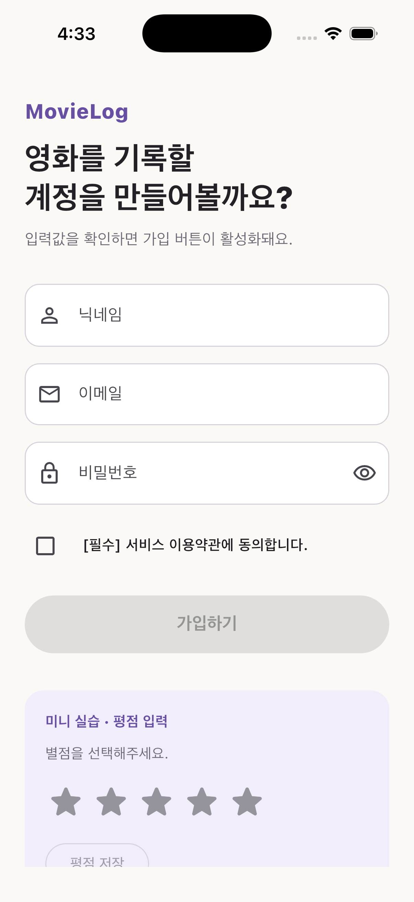

# 2주차 프론트엔드 미션: MovieLog 회원가입 Form

## 미션 목표

2주차 워크북의 Required Mission에 맞춰 모바일 회원가입 Form을 완성했다. 실제 API는 연결하지 않고, 로컬 상태만으로 입력·오류·완료 상태를 표현했다.



## 구현 결과

| 요구사항 | 구현 |
| --- | --- |
| 닉네임·이메일·비밀번호 입력창 | `TextFormField` 3개와 한국어 validator 구현 |
| 오류 메시지 | 빈 값, 닉네임 2글자 미만, 이메일 형식, 비밀번호 8자 미만을 구분 |
| 약관 동의 | 필수 `CheckboxListTile`과 `bool` 상태 구현 |
| 가입 버튼 활성화 | 모든 빠른 조건과 약관 동의가 충족될 때만 활성화 |
| 최종 검증 | 버튼 클릭 시 `FormState.validate()`를 다시 호출 |
| 키보드 overflow 대응 | `SingleChildScrollView`와 `keyboardDismissBehavior.onDrag` 적용 |
| 리소스 정리 | Controller 3개와 FocusNode 2개를 `dispose()`에서 해제 |
| Widget 분리 | `MovieLogTextFormField`, `TermsAgreementTile`, `RatingPracticeCard`으로 분리 |
| 추가 미니 실습 | `flutter_rating_bar`로 별점 상태와 저장 버튼 구현 |
| Challenge 대응 | `LayoutBuilder`에서 너비 700 이상이면 폼을 최대 560px로 가운데 정렬 |

## 폴더 아키텍처

```text
movie_log_week2/
├── lib/
│   ├── main.dart
│   ├── app/movie_log_app.dart
│   ├── core/theme/app_theme.dart
│   └── features/
│       ├── sign_up/presentation/
│       │   ├── sign_up_screen.dart
│       │   └── widgets/
│       └── rating/presentation/widgets/
├── test/widget_test.dart
└── pubspec.yaml
```

앱 전체 설정은 `app`, 여러 기능에서 공유 가능한 색상·테마는 `core`, 회원가입과 별점 UI는 각각 `features`에 둔다. 현재는 API나 저장소가 없는 로컬 UI 과제이므로 불필요한 `data`·`domain` 계층은 만들지 않았다. 서버 통신이나 회원가입 use case가 추가될 때만 해당 feature 아래에 계층을 확장할 수 있다.

## 미션 기록

1. 워크북의 화면 요구사항을 입력 필드, 검증 규칙, 약관 상태, 버튼 상태로 나눴다.
2. `StatefulWidget`에 Controller·FocusNode·약관·비밀번호 표시 여부·별점 상태를 두고 `dispose()`를 구현했다.
3. 모바일 overflow를 막기 위해 `SafeArea → LayoutBuilder → ConstrainedBox → SingleChildScrollView → Form` 구조를 만들었다.
4. 중복되는 입력 UI를 `MovieLogTextFormField`로, 약관과 별점을 별도 Widget으로 분리했다.
5. `flutter_rating_bar`를 추가해 별점이 0점이면 저장 버튼이 비활성화되고, 선택 후 활성화되게 했다.
6. iPhone 17 Pro 시뮬레이터에서 iOS Debug 빌드·설치·실행 후 초기 화면을 캡처했다.

## 검증 결과

- `dart format lib test`: 성공
- `flutter test`: 성공 — 유효한 닉네임·이메일·비밀번호와 약관 동의 후 가입 버튼이 활성화되는지 확인
- `flutter build ios --simulator --debug`: 성공
- iPhone 17 Pro 시뮬레이터 설치·실행: 성공
- `flutter analyze`: 분석 서버가 LSP 메시지를 파싱하는 환경 오류로 종료했다. 위젯 테스트와 iOS 빌드는 통과했지만, 분석 성공으로 표기하지 않는다.

## 실행 방법

```bash
cd mission/Frontend/chapter02/movie_log_week2
flutter pub get
flutter test
flutter run
```

## 참고 자료

- [UMC 11기 PE 2주차 - 레이아웃과 사용자 입력 (1)](https://makeus-challenge.notion.site/2-1-3e3b57f4596b80e591a5ebab81d52b68?source=copy_link)
- [Flutter - Build a form with validation](https://docs.flutter.dev/cookbook/forms/validation)
