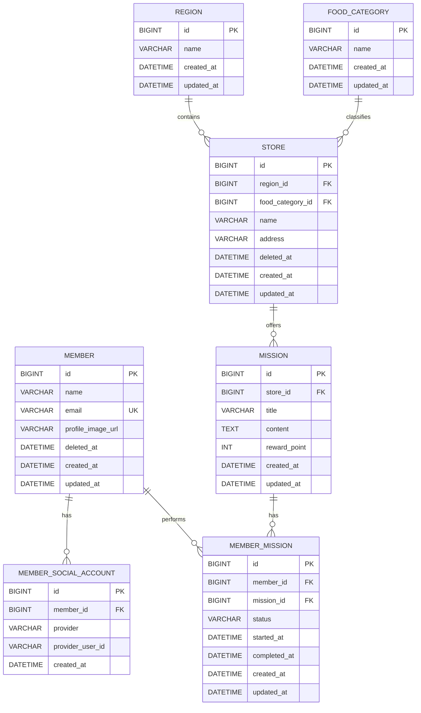

# 1주차 백엔드 미션: 지역·가게·미션 리워드 서비스 ERD

## 서비스 요약

지역마다 여러 가게가 있고, 회원은 가게 방문 미션을 완료해 포인트를 받는다. 한 지역에서 미션 10개를 완료하면 1,000 Point를 받는다.

이번 설계는 주어진 IA와 와이어프레임을 바탕으로 한 데이터 모델 해석이다. 지도·검색, 포인트 내역, 알림 설정, 사장님 점포 관리 기능은 미션의 난이도 완화 범위에 따라 제외했다.

## 설계 과정

1. 로그인과 회원가입 화면에서 회원과 소셜 로그인 정보를 분리했다. 한 회원이 여러 소셜 계정을 연결할 수 있으므로 `member_social_account`를 별도 테이블로 두었다.
2. 홈의 지역, 가게, 음식 카테고리를 각각 엔티티로 정리했다. 지역 하나에는 여러 가게가, 음식 카테고리 하나에도 여러 가게가 연결될 수 있다.
3. 미션은 가게에 속하도록 `mission.store_id`를 두었다. 가게 하나에 여러 미션이 존재할 수 있다.
4. 회원과 미션은 N:M 관계이므로 `member_mission`을 만들었다. 미션 수행 상태와 시각은 회원이나 미션 자체가 아닌 이 관계에 속한다.
5. 회원과 가게는 물리 삭제 대신 `deleted_at`을 두어 Soft Delete를 고려했다.

## ERD

> ERDCloud 로그인 오류로 인해 현재 다이어그램은 Mermaid로 작성했다. Mermaid의 관계선은 설계 의도를 표현한 것이며, ERDCloud 프로젝트 생성 완료를 의미하지 않는다.

## 테이블과 제약조건

| 테이블 | 역할 | 핵심 제약조건 |
| --- | --- | --- |
| `member` | 가입한 회원과 탈퇴 상태를 관리한다. | `id` PK, `email` UNIQUE, `name` NOT NULL, `deleted_at` NULL 허용 |
| `member_social_account` | 소셜 로그인 식별자를 저장한다. | `member_id` FK, `(provider, provider_user_id)` UNIQUE |
| `region` | 홈에서 지역을 묶어 보여주고 지역별 완료 수를 집계한다. | `id` PK, `name` UNIQUE NOT NULL |
| `food_category` | 가게의 음식 분류를 관리한다. | `id` PK, `name` UNIQUE NOT NULL |
| `store` | 지역과 음식 카테고리에 속한 가게를 저장한다. | `region_id`, `food_category_id` FK 및 NOT NULL, `deleted_at` NULL 허용 |
| `mission` | 가게 방문으로 수행하는 미션을 저장한다. | `store_id` FK 및 NOT NULL, `title`·`content`·`reward_point` NOT NULL |
| `member_mission` | 회원별 미션 수행 상태와 완료 시각을 저장한다. | 두 FK NOT NULL, `(member_id, mission_id)` UNIQUE |

모든 테이블의 PK는 `id BIGINT AUTO_INCREMENT NOT NULL`로 통일하는 것을 전제로 했다. 실제 DBMS에 따라 자동 증가 문법은 달라질 수 있다. 예를 들어 PostgreSQL에서는 `BIGINT GENERATED ... AS IDENTITY` 같은 문법을 선택할 수 있다.

### 카디널리티

- `member` : `member_social_account` = 1:N
- `region` : `store` = 1:N
- `food_category` : `store` = 1:N
- `store` : `mission` = 1:N
- `member` : `mission` = N:M, `member_mission`으로 구현

`member_mission`의 `(member_id, mission_id)` UNIQUE 제약은 같은 회원이 같은 미션을 중복 수행하는 것을 막는다. 완료한 미션 수는 `member_mission.status = 'completed'`를 기준으로 세고, `mission → store → region`을 따라 특정 지역의 완료 수를 계산한다.

## 10개 미션 완료 보상 처리

미션 요구사항의 “지역별 10개 완료 시 1,000 Point”는 완료 수를 조회해 달성 여부를 판단할 수 있다. 다만 이번 미션은 포인트 내역 관리를 제외했으므로, 포인트 지급 이력은 테이블로 저장하지 않았다.

실서비스에서는 중복 지급을 방지하기 위해 `point_ledger` 또는 `region_reward_grant` 테이블을 추가하고, `(member_id, region_id, reward_type)`에 UNIQUE 제약을 두는 방식을 고려할 수 있다. 이는 현재 ERD의 필수 범위 밖이다.

## 실습 체크리스트

- [ ] ERDCloud에 새 프로젝트를 생성하고 다이어그램을 작성했는가?
  - ERDCloud 로그인 오류로 Mermaid로 먼저 작성했다. ERDCloud 프로젝트 생성은 아직 확인하지 못했다.
- [x] 테이블명과 컬럼명에 snake_case 소문자 컨벤션을 적용했는가?
- [x] 모든 테이블의 PK를 `id` (BIGINT, Auto Increment)로 통일했는가?
- [x] 1:N 관계를 비식별 관계로 설계했는가?
- [x] 회원-미션 N:M 관계에 중간 매핑 테이블을 두었는가?
- [x] 필수값과 선택값의 `NOT NULL` 제약조건을 구분했는가?
- [x] 회원 탈퇴와 가게 삭제를 고려해 Soft Delete 컬럼을 두었는가?

## 미션 기록

### 1. 화면과 요구사항에서 데이터 찾기

로그인/회원가입 화면에서는 회원과 소셜 로그인 식별자가 필요하다. 홈에서는 지역, 가게, 음식 카테고리가 필요하고, 미션 화면에서는 미션 내용과 회원별 수행 상태가 필요하다. 화면에 보인다는 이유만으로 한 테이블에 모두 넣지 않고, 데이터가 여러 곳에서 재사용되는지와 관계가 무엇인지 먼저 확인했다.

### 2. 관계 정리

지역과 가게, 가게와 미션은 각각 1:N이다. 회원과 미션은 한 회원이 여러 미션을 수행하고 하나의 미션도 여러 회원이 수행하므로 N:M이다. 따라서 `member_mission`에 상태와 완료 시각을 함께 둬야 한다.

### 3. 제약조건 점검

존재하지 않는 지역이나 가게를 참조하지 않도록 FK를 두고, 필수 관계의 FK는 `NOT NULL`로 둔다. 소셜 로그인 식별자와 회원-미션 조합에는 UNIQUE 제약을 두어 중복 데이터를 막는다.

### 4. 다이어그램 작성 방식

ERDCloud 로그인 오류가 있어 Mermaid로 ERD를 작성했다. 이후 ERDCloud 접근이 가능해지면 같은 엔티티와 관계를 옮겨 작성하고, 1:N 비식별 관계선을 다시 확인할 예정이다.

## 참고 자료

- [PostgreSQL 18 - Constraints](https://www.postgresql.org/docs/current/ddl-constraints.html)
- [PostgreSQL 18 - Indexes Introduction](https://www.postgresql.org/docs/current/indexes-intro.html)
- [IBM - Database normalization](https://www.ibm.com/think/topics/database-normalization)
